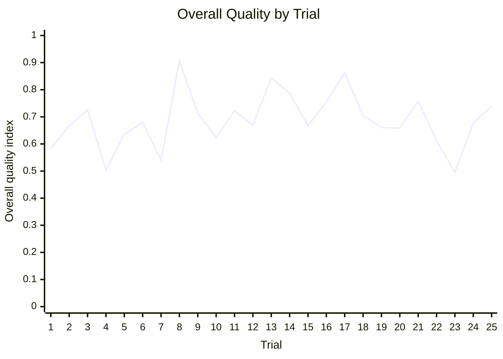

# OpenQG

<!-- jankurai-badge:start -->
[](target/jankurai/current-audit.md)
<!-- jankurai-badge:end -->

OpenQG is an evidence-gated benchmark and control plane for interpretable
unified-physics theories.

It keeps candidate quantum-gravity work close to typed manifests, reproducible
smoke data, explicit scores, and auditable release receipts. The first release
is intentionally conservative: baseline physics stays anchored to
`SM + GR + LambdaCDM + massive neutrinos`, public data is tracked through
manifests instead of raw dumps, and candidate theories must expose named
physical parameters.

## Quick Start

```bash
just setup
just fast
just check
just security
just release-check
jankurai audit . \
  --json target/jankurai/current-audit.json \
  --md target/jankurai/current-audit.md \
  --no-score-history
```

## Hero/Judge Live Progress

The 2026-05-23 live Hero/Judge run exercised 25 one-generation trials and
produced a mixed accepted/rejected frontier set for review.

| Metric | Value |
| --- | ---: |
| Trials | 25 |
| Promoted | 17 |
| Rejected | 8 |
| Mean overall quality | 0.688 |
| Mean hero lane score | 0.780 |
| Mean judge lane score | 0.710 |
| Timeout-substitute receipts | 28 |



The promotion gate accepted 17 trials; the main quality dips were trials 4, 7,
22, and 23, with trial 23 the lowest rejected row. See the full analysis and
artifact hashes in [reports/hero-judge-progress/2026-05-23.md](reports/hero-judge-progress/2026-05-23.md).

## Surface Map

- `crates/openqg-core`: typed manifests, validation helpers, and scoring primitives
- `crates/openqg-data`: registry loading, data locks, and fixture verification
- `crates/openqg-bench`: CLI orchestration for schema, data, benchmark, score,
  release, and ZYAL lanes
- `contracts/specs`: editable YAML contract specs
- `contracts/generated/schemas`: generated JSON schemas from `just schema-sync`
- `contracts/registry.yml`: source-of-truth registry for contract generation
- `data/registry`: public dataset source manifests
- `benchmarks/suites`: benchmark suite manifests
- `theories`: baseline and candidate theory manifests
- `agent/zyal`: runnable research and maintenance loops
- `reports/releases/draft`: generated draft release pack from `just release-pack`

## Release

`v0.1.1` is the current release candidate for the OpenQG control plane. It ships
the Rust benchmark workspace, contract registry, smoke benchmark lane, Jankurai
audit evidence, ZYAL runbooks, release-pack generation, and the initial
documentation surface.

Publication follows the evidence gate in [docs/release.md](docs/release.md).
The draft release manifest remains `approved: false` until review records the
approval outside the generated release pack.

## Key Links

- [Moonshot](docs/MOONSHOT.md)
- [Architecture](docs/architecture.md)
- [Boundaries](docs/boundaries.md)
- [Testing](docs/testing.md)
- [Scoring](docs/scoring.md)
- [Benchmark methodology](docs/benchmark-methodology.md)
- [Theory admission](docs/theory-admission.md)
- [Release process](docs/release.md)

## Policy

- Do not commit raw upstream data, secrets, or derived lockfiles.
- Do not broaden generated zones without updating `agent/generated-zones.toml`.
- Keep candidate theories readable: every parameter needs unit, meaning, and provenance.
