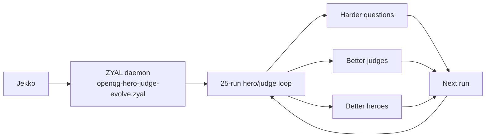

# OpenQG

<!-- jankurai-badge:start -->

<!-- jankurai-badge:end -->

OpenQG exists to evolve harder questions and harder answers through one live
25-run hero/judge loop, with Jekko driving the ZYAL daemon.

Support code and data stay here only because they help that loop run, score,
and explain itself. The loop is the point.

## Live Loop

The live path is:

The single daemon entrypoint is
[agent/zyal/openqg-hero-judge-evolve.zyal](agent/zyal/openqg-hero-judge-evolve.zyal).

## Example

The 25-run report and the daemon file are the two places to start:

> Report: [reports/hero-judge-progress/2026-05-23.md](reports/hero-judge-progress/2026-05-23.md)
>
> Daemon: [agent/zyal/openqg-hero-judge-evolve.zyal](agent/zyal/openqg-hero-judge-evolve.zyal)
>
> Trial 008: promoted, overall quality `0.905`
>
> Trial 017: promoted, overall quality `0.862`
>
> Trial 023: rejected, overall quality `0.495`

## What Lives Here

- `agent/zyal/openqg-hero-judge-evolve.zyal`: the single live daemon runbook.
- `reports/hero-judge-progress/2026-05-23.md`: the 25-run live report with examples and summary metrics.
- `crates/openqg-core`, `crates/openqg-data`, `crates/openqg-bench`: support code for validation, scoring, and data loading.
- `contracts/`, `benchmarks/`, `data/`, `theories/`: manifests and data surfaces that feed the loop.
- `docs/`: boundary, testing, release, and ZYAL notes that keep the loop auditable.
